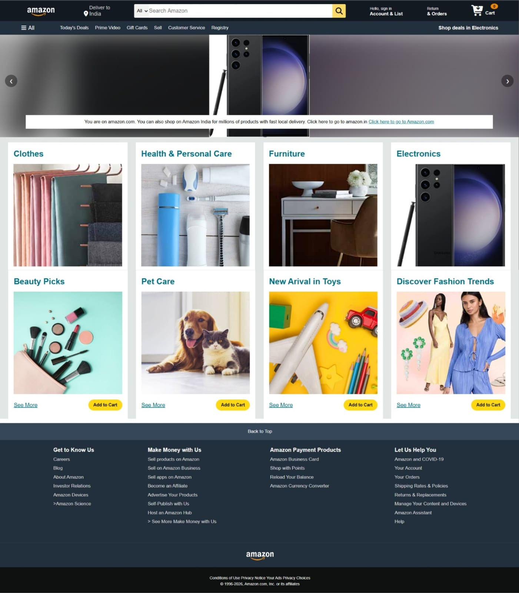

## 📸 Screenshot




# Amazon Clone 🛒

A front-end clone of Amazon's website built using **HTML, CSS, and JavaScript**, featuring product listings and a working shopping cart.

🔗 **Live Demo:** [golden-travesseiro-44c561.netlify.app](https://golden-travesseiro-44c561.netlify.app)

## ✨ Features

- Responsive product listing page styled after Amazon's UI
- Add to cart / remove from cart functionality
- Dynamic cart total and item count updates
- Clean, semantic HTML structure with modular CSS
- Fully static — no backend/database required

## 🛠️ Tech Stack

- **HTML5** — page structure & markup
- **CSS3** — styling and responsive layout
- **JavaScript (Vanilla)** — cart logic and DOM manipulation


## 🚀 Getting Started

Clone the repo and open `index.html` directly in your browser — no build step needed.

```bash
git clone https://github.com/ayushkardam2004-stack/amazon-clone.git
cd amazon-clone
```

Then just open `index.html` in your browser (or use the Live Server extension in VS Code).

## 📂 Folder Structure

```
amazon-clone/
├── index.html
├── style.css
├── script.js
└── assets/
```

## 🙋‍♂️ Author

**Ayush Kardam**
- GitHub: [@ayushkardam2004-stack](https://github.com/ayushkardam2004-stack)
- LinkedIn: [ayush-kardam](https://www.linkedin.com/in/ayush-kardam-a593932bb/)
- Email: ayushkardam2004@gmail.com

## 📄 License

This project is for learning/portfolio purposes only. Amazon's branding, logo, and trademarks belong to Amazon.com, Inc. and are used here purely for educational, non-commercial demonstration.
